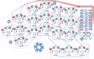

 

  <!-- Colors:
    Dark Blue: #258DA8
    Light Blue: #50ABE2
    Dark Red: #C83434
    Light Red: #CE4785
 -->
  
    
  <b>Snowflake</b>
  
My first 100% self made keyboard.

      <!--~###################################~-->
    <!--~####    Open issues and PRs    ####~-->
    <!--~###################################~-->
    <a href="https://github.com/Tygo-van-den-Hurk/Snowflake-Hardware/issues?q=is%3Aissue%20state%3Aopen%20label%3Afix">
      <picture>
        <source srcset="https://img.shields.io/github/issues/Tygo-van-den-Hurk/Snowflake-Hardware/fix?style=flat&labelColor=FFFFFF&color=50ABE2&logoColor=5E2751&label=Bug%20Reports" media="(prefers-color-scheme: light)" />
        
      </picture>
    </a>
    <a href="https://github.com/Tygo-van-den-Hurk/Snowflake-Hardware/issues?q=is%3Aissue%20state%3Aopen%20label%3Afeat">
      <picture>
        <source srcset="https://img.shields.io/github/issues/Tygo-van-den-Hurk/Snowflake-Hardware/feat?style=flat&labelColor=FFFFFF&color=50ABE2&logoColor=5E2751&label=Feature%20Requests" media="(prefers-color-scheme: light)" />
        
      </picture>
    </a>
    <a href="https://github.com/Tygo-van-den-Hurk/Snowflake-Hardware/blob/main/LICENSE">
      <picture>
        <source srcset="https://img.shields.io/github/license/Tygo-van-den-Hurk/Snowflake-Hardware?style=flat&labelColor=FFFFFF&color=50ABE2&logoColor=5E2751&label=Licence" media="(prefers-color-scheme: light)" />
        
      </picture>
    </a>
    <!-- NEW LINE -->  
    <a href="https://github.com/Tygo-van-den-Hurk/Snowflake-Hardware/stargazers">
      <picture>
        <source srcset="https://img.shields.io/github/stars/Tygo-van-den-Hurk/Snowflake-Hardware?style=flat&labelColor=FFFFFF&color=CE4785&label=Stars" media="(prefers-color-scheme: light)" />
        
      </picture>
    </a>
    <a href="https://github.com/Tygo-van-den-Hurk/Snowflake-Hardware/releases">
      <picture>
        <source srcset="https://img.shields.io/github/release/Tygo-van-den-Hurk/Snowflake-Hardware?style=flat&display_name=release&label=Release&labelColor=FFFFFF&color=CE4785" media="(prefers-color-scheme: light)" />
        
      </picture>
    </a>
  <!--~###################################~-->
  <!--~####      Repository CI/CD     ####~-->
  <!--~###################################~-->
  <a href="https://github.com/Tygo-van-den-Hurk/Snowflake-Hardware/actions/workflows/nix-github-actions.yml">
    <picture>
      <source srcset="https://img.shields.io/github/actions/workflow/status/Tygo-van-den-Hurk/Snowflake-Hardware/nix-github-actions.yml?style=flat&labelColor=FFFFFF&color=CE4785&logo=GitHub%20Actions&logoColor=000000&branch=main&event=push&label=CI" media="(prefers-color-scheme: light)" />
      
    </picture>
  </a>
  <a href="https://github.com/Tygo-van-den-Hurk/Snowflake-Hardware/actions/workflows/deploy-github-pages.yml">
    <picture>
      <source srcset="https://img.shields.io/github/actions/workflow/status/Tygo-van-den-Hurk/Snowflake-Hardware/deploy-github-pages.yml?style=flat&labelColor=FFFFFF&color=CE4785&logo=readthedocs&logoColor=000000&branch=main&event=push&label=Docs" media="(prefers-color-scheme: light)" />
      
    </picture>
  </a>

 

This repository is for the journey of me making my first keyboard: _Snowflake_.
I wanted a keyboard that works for me, I wanted something that I could take
with me anywhere and would work the way I designed it to do. This also was a
good excuse to learn about keyboards which is something I've wanted to do for
a while now.

## Software

Since every hardware iteration has different software configuration they've
been moved into their own repositories:

- v1: doesn't have firmware as the PCB had errors in it.
- v2: has [its own firmware repository][v2] for firmware.

## Credits

This code is written by, or using the help of:

- [@Narkoleptika][@nark] for providing the pro micro footprint and setting me
  up with a template.
- [@RajuBuddharaju][@raju] for helping me realize every part of this keyboard.
- [@Tygo-van-den-Hurk][@tygo] for finalizing the design.

To see how to start or develop see [CONTRIBUTING.md][contributing].

[@nark]: https://github.com/Narkoleptika
[@raju]: https://github.com/RajuBuddharaju
[@tygo]: https://redirects.tygo.van.den.hurk.dev/github/personal/
[contributing]: ./CONTRIBUTING.md
[v2]: https://github.com/Tygo-van-den-Hurk/Snowflake-v2-Firmware
