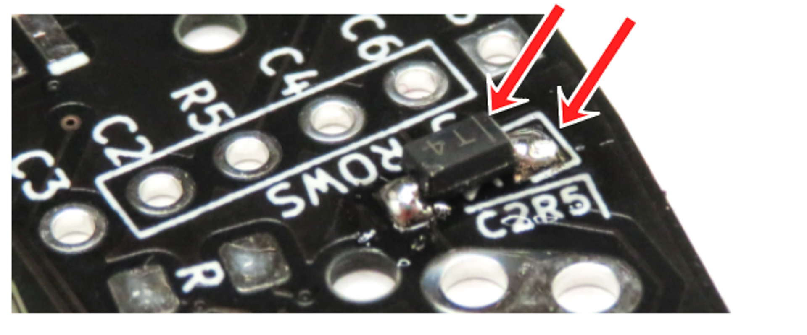
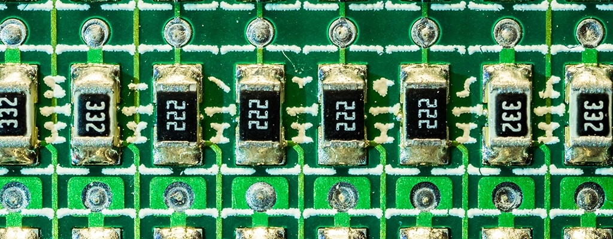

> This page is for documentation relating ergogen.

[< Back to the main documentation page](../README.md)

# Guide

- [Guide](#guide)
  - [Overview](#overview)
  - [Components](#components)
  - [Assembly](#assembly)
    - [Diodes](#diodes)
    - [Resistors](#resistors)
    - [TRRS connector](#trrs-connector)
    - [Switch sockets or Switches](#switch-sockets-or-switches)
    - [Button](#button)
    - [Microcontroller](#microcontroller)
  - [Firmware](#firmware)
  - [Case](#case)
    - [Printing the case](#printing-the-case)
    - [Adding the Inserts](#adding-the-inserts)

## Overview

In this guide I will tell you how to get from nothing to a working keyboard.

## Components

To build the keyboard you require the following physical components:

| quantity | Name | Part number | Description |
| -------- | ---------------------- | -------------------- | --------------------------------------------------------------------------------------- |
| 2 | PCB | - | The Snowflake PCB order from a fabricator |
| 2 | TRRS connector | TRRS-PJ-320A-dual | Connector to connect the 2 halves. |
| 2 | Reset button | wuerth-434121025816 | Any button of the right size will work. |
| 2 | 0805 SMD Resistor 4.7k | RC0805JR-074K7L | Any resistor between 2.2k and 10k will work, with 4.7k being optimal. |
| 2 | 0805 SMD Resistor 10k | RC0805FR-0710KL | Any resistor between 2.2k and 10k will work, with 10k being optimal. |
| 36 | choc switches | - | Any choc switch will work, pick your favorite. |
| 36 | choc key caps | - | Any choc key cap will work, pick your favorite. |
| 36 | Diodes | 1N4148W Signal Diode | These are the exact ones I got, but I think that a lot of diodes will work. |
| 2 | RP2040 Pro Micro | - | Buying any other pro micro based pro micro will require changing the firmware yourself. |
| 6 | M2 inserts and screws | - | to secure your PCB into the case. |

You will also need solder equipment and supplies like solder. This is entire up to you.

## Assembly

Now that we've got our components, let's assemble our keyboard.

### Diodes

> [!CAUTION]
> This will take a while and is not trivial if you are a first time solderer because of the small size.

To assemble the keyboard start with the diodes. Solder a diode on the back of every key for both boards.

Make sure to line up the diode' line with the closed line on the PCB as seen in the picture.

> [!TIP]
> I found the easiest way to put 2 small blobs of solder on the pads, then hold it in place with a tweezer and then solder 1 side first, and then press down to solder the other side.

### Resistors

> [!CAUTION]
> This step is also hard like the last one for beginners to soldering. Don't be disheartened. I was a beginner to and was able to do it too.

Next solder the resistors. The $10k\\Omega$ ones go onto the jumper below the microcontroller, and the $4.7k\\Omega$ ones go below the TRRS connector.

### TRRS connector

Moving on to an easy component: the TRRS connector. This is located below the controller and should not be too much of a hassle to solder into place. They only go in one way.

### Switch sockets or Switches

Depending on if you are going to have hot-swap-able key switches you will have to solder either the sockets or switches onto the PCB. Both have up and down sides. pick whatever works for you.

### Button

Soldering the button is much line soldering the diodes and resistors. They are not through hole, and therefore require some skill. It should not be to much harder then those two.

### Microcontroller

To solder the micro controller, first connect the jumpers on the sides. Then add the (optional) socket for the microcontroller. It should now look something like this:

Next add the headers and place the micro controller on top of that. Then solder it into place. The resulting thing should now look something like this:

## Firmware

For the firmware you'll need to flash that onto your board. Look at the version of your snowflake on the PCB. Then search for it's release on [it's release page](https://github.com/Tygo-van-den-Hurk/Snowflake/releases). In that repository you will find further instructions.

You should now have a working keyboard!

## Case

You don't want to rock your keyboard raw. There is a large chance that you break off one of the components on the bottom. That's why you print the case.

### Printing the case

First download the case files from the release page, and open this in your slicer of choice. Next, slice and upload to your 3D printer.

> [!CAUTION]
> The case is precisely made for the PCB. This means that there is 0 room for tolerance, Adjust your printer settings accordingly to have a small (1mm) gap between the PCB and the inner walls.

### Adding the Inserts

Heat your solder iron to 220 degrees. Put the insert in place and hold with tweezers. Now press down and into place with the hot iron. It should sit flush with the walls of the insert.

secure your PCB with M2 screws into the inserts and now you are done.
